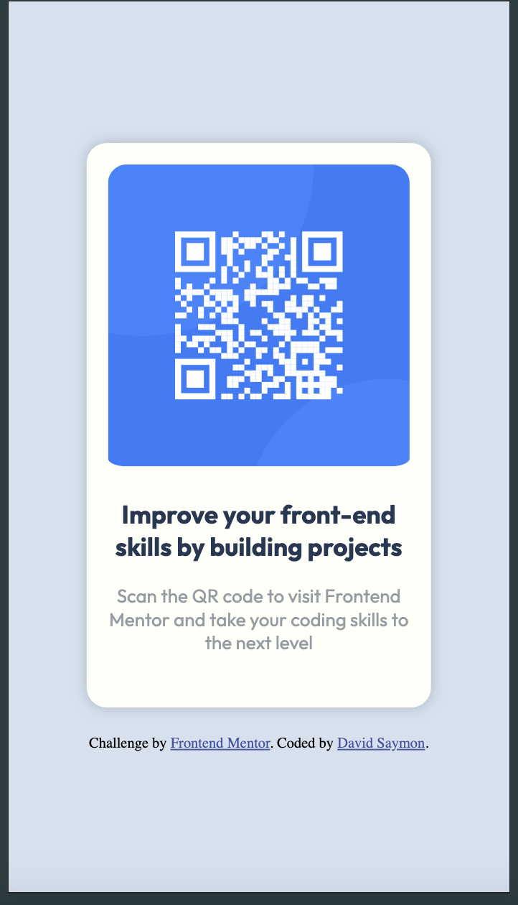

# Frontend Mentor - Solução do componente de código QR

Esta é uma solução para o [desafio do componente de código QR no Frontend Mentor](https://www.frontendmentor.io/challenges/qr-code-component-iux_sIO_H). 

## Índice

- [Frontend Mentor - Solução do componente de código QR](#frontend-mentor---solução-do-componente-de-código-qr)
  - [Índice](#índice)
  - [Visão Geral](#visão-geral)
    - [Captura de Tela](#captura-de-tela)
    - [Links](#links)
  - [Meu Processo](#meu-processo)
    - [Construído com](#construído-com)
    - [O que eu aprendi](#o-que-eu-aprendi)
  - [Autor](#autor)

## Visão Geral

### Captura de Tela

### Links

- URL da Solução: [Código no Github](https://github.com/davidsaymon/qrCode.git)
- URL do Site ao Vivo: [Vercel](https://qr-code-opal-phi.vercel.app/)

## Meu Processo

### Construído com

- Marcação HTML5 semântica
- Propriedades personalizadas do CSS
- Flexbox
- Fluxo de trabalho mobile-first
- [Gulp](https://gulpjs.com/) - Ferramenta de automação de tarefas
- [Sass](https://sass-lang.com/) - Pré-processador CSS
- [Gulp Imagemin](https://www.npmjs.com/package/gulp-imagemin) - Otimização de imagens> (Apesar de não achar necessário pela pouca quantidade de imagens, estou praticando).

### O que eu aprendi

Neste projeto, pratiquei padronização de estrutura, a importância de configurar um ambiente de desenvolvimento eficiente utilizando ferramentas como Gulp para automatizar tarefas e otimizar meu fluxo de trabalho.

## Autor
- Frontend Mentor - @davidsaymon
- GitHub - @davidsaymon
